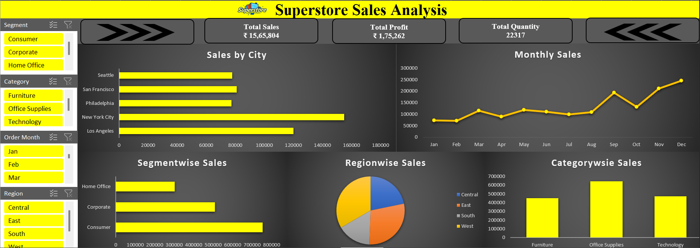

# 📊 Superstore Sales Dashboard

This Excel-based dashboard provides a comprehensive analysis of sales data from a fictional Superstore. It visualizes key metrics and trends to support business insights and decision-making.

---

## 📌 Project Overview

The **Superstore Sales Dashboard** analyzes sales performance across multiple dimensions including:
- Segments
- Product categories
- Order months
- Regions
- Cities

It helps stakeholders monitor **total sales**, **profits**, and **quantities sold**, while identifying trends and high-performing areas.

---

## 📁 File Contents

- `SuperStore Sales Dashboard.xlsx` - Main Excel file with interactive dashboard and visualizations.

---

## 🔍 Key Metrics Displayed

- **Total Sales**: ₹15,65,804  
- **Total Profit**: ₹1,75,262  
- **Total Quantity Sold**: 22,317  

---

## 📊 Dashboard Components

1. **Filters Panel (Left Sidebar)**  
   Filter dashboard views by:
   - Segment (Consumer, Corporate, Home Office)
   - Category (Furniture, Office Supplies, Technology)
   - Month (Jan–Dec)
   - Region (Central, East, South, West)

2. **Sales by City (Bar Chart)**  
   Visualizes sales performance for top cities like New York City, Los Angeles, and Philadelphia.

3. **Monthly Sales (Line Chart)**  
   Tracks monthly sales trends throughout the year.

4. **Segment-wise Sales (Bar Chart)**  
   Compares sales across different customer segments.

5. **Region-wise Sales (Pie Chart)**  
   Shows contribution of each region to overall sales.

6. **Category-wise Sales (Bar Chart)**  
   Displays sales by product category.

---

## 🖼️ Dashboard Preview

---

## 🎯 Insights

- **Top Performing City**: New York City  
- **Best Performing Segment**: Consumer  
- **Sales Peak**: December shows the highest monthly sales.  
- **Highest Sales Category**: Office Supplies  

---

## 🛠️ How to Use

1. Open `SuperStore Sales Dashboard.xlsx` in Microsoft Excel (recommended version: 2016 or later).
2. Use slicers on the left to filter data interactively.
3. Hover over charts for detailed tooltips.
4. Use this dashboard to make data-driven decisions in sales strategy, inventory planning, and regional targeting.

---

## 💡 Tools Used

- Microsoft Excel  
- Pivot Tables  
- Slicers  
- Charts (Bar, Line, Pie)  
- Conditional Formatting  

---

## 📧 Contact

For any feedback or collaboration opportunities:  
**Author**: Sarthak Salvi  
**Email**: [sarthaksalvi2107@gmail.com](mailto:sarthaksalvi2107@gmail.com)

---

> ⭐ If you found this project insightful, consider starring this repository!

